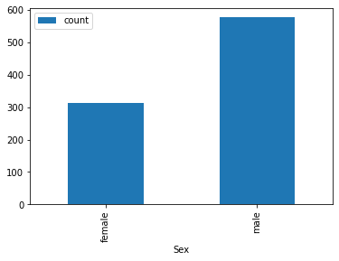
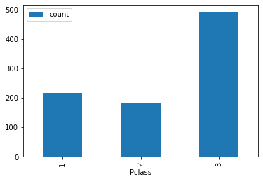
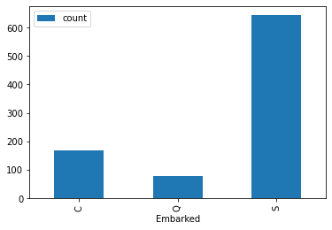
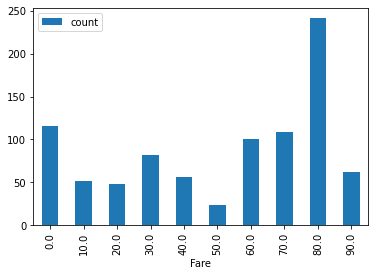
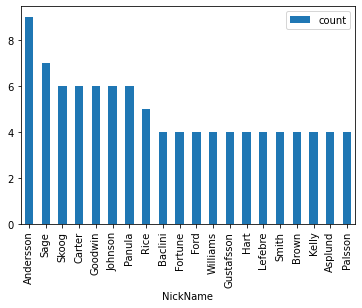
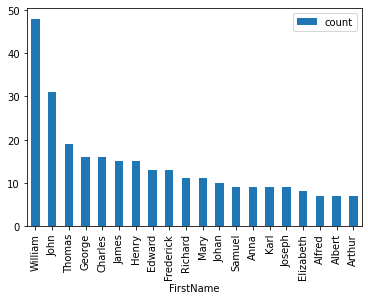

## 타이타닉 데이터를 활용한 분석 및 시각화 예제

<br>
<br>
<br>
<br>


```python
import pandas as pd
import numpy as np
import matplotlib.pyplot as plt
```


```python
datas = pd.read_csv("titanic/train.csv")
print(type(datas))
datas
```


```python
groupby_sex = datas.groupby('Sex')
df1 = pd.DataFrame({'count' : groupby_sex.size()}).reset_index()
```


```python
df1.plot(kind='bar',x='Sex',y='count')
plt.show()
```


    

    


```python
groupby_pclass = datas.groupby('Pclass')
df2 = pd.DataFrame({'count' : groupby_pclass.size()}).reset_index()
```


```python
df2.plot(kind='bar',x='Pclass',y='count')
plt.show()
```


    

    


```python
groupby_pclass = datas.groupby('Embarked')
df3 = pd.DataFrame({'count' : groupby_pclass.size()}).reset_index()
```


```python
df3.plot(kind='bar',x='Embarked',y='count')
plt.show()
```


    

    


```python
# 소수점 반올림한 후에 10의 자리로 count
df4 = pd.DataFrame({'Fare': (datas["Fare"].round(0)%10)*10})
groupby_Fare = df4.groupby('Fare')
df4 = pd.DataFrame({'count' : groupby_Fare.size()}).reset_index()
df4
```


<div>
<style scoped>
    .dataframe tbody tr th:only-of-type {
        vertical-align: middle;
    }

    .dataframe tbody tr th {
        vertical-align: top;
    }

    .dataframe thead th {
        text-align: right;
    }
</style>
<table border="1" class="dataframe">
  <thead>
    <tr style="text-align: right;">
      <th></th>
      <th>Fare</th>
      <th>count</th>
    </tr>
  </thead>
  <tbody>
    <tr>
      <th>0</th>
      <td>0.0</td>
      <td>116</td>
    </tr>
    <tr>
      <th>1</th>
      <td>10.0</td>
      <td>52</td>
    </tr>
    <tr>
      <th>2</th>
      <td>20.0</td>
      <td>48</td>
    </tr>
    <tr>
      <th>3</th>
      <td>30.0</td>
      <td>82</td>
    </tr>
    <tr>
      <th>4</th>
      <td>40.0</td>
      <td>56</td>
    </tr>
    <tr>
      <th>5</th>
      <td>50.0</td>
      <td>24</td>
    </tr>
    <tr>
      <th>6</th>
      <td>60.0</td>
      <td>101</td>
    </tr>
    <tr>
      <th>7</th>
      <td>70.0</td>
      <td>109</td>
    </tr>
    <tr>
      <th>8</th>
      <td>80.0</td>
      <td>241</td>
    </tr>
    <tr>
      <th>9</th>
      <td>90.0</td>
      <td>62</td>
    </tr>
  </tbody>
</table>
</div>


```python
df4.plot(kind='bar', x='Fare', y = 'count')
plt.show()
```


    

    


```python
datas['NickName'] = datas['Name'].apply(lambda v: v.split(',')[0])
groupby_nickname = datas.groupby('NickName')
df5 = pd.DataFrame({'count' : groupby_nickname.size()}).reset_index()
df5 = df5.sort_values(by='count', ascending=False)[:20]
df5
```


<div>
<table border="1" class="dataframe">
  <thead>
    <tr style="text-align: right;">
      <th></th>
      <th>NickName</th>
      <th>count</th>
    </tr>
  </thead>
  <tbody>
    <tr>
      <th>16</th>
      <td>Andersson</td>
      <td>9</td>
    </tr>
    <tr>
      <th>532</th>
      <td>Sage</td>
      <td>7</td>
    </tr>
    <tr>
      <th>563</th>
      <td>Skoog</td>
      <td>6</td>
    </tr>
    <tr>
      <th>100</th>
      <td>Carter</td>
      <td>6</td>
    </tr>
    <tr>
      <th>220</th>
      <td>Goodwin</td>
      <td>6</td>
    </tr>
    <tr>
      <th>292</th>
      <td>Johnson</td>
      <td>6</td>
    </tr>
    <tr>
      <th>464</th>
      <td>Panula</td>
      <td>6</td>
    </tr>
    <tr>
      <th>505</th>
      <td>Rice</td>
      <td>5</td>
    </tr>
    <tr>
      <th>32</th>
      <td>Baclini</td>
      <td>4</td>
    </tr>
    <tr>
      <th>189</th>
      <td>Fortune</td>
      <td>4</td>
    </tr>
    <tr>
      <th>187</th>
      <td>Ford</td>
      <td>4</td>
    </tr>
    <tr>
      <th>647</th>
      <td>Williams</td>
      <td>4</td>
    </tr>
    <tr>
      <th>227</th>
      <td>Gustafsson</td>
      <td>4</td>
    </tr>
    <tr>
      <th>243</th>
      <td>Hart</td>
      <td>4</td>
    </tr>
    <tr>
      <th>332</th>
      <td>Lefebre</td>
      <td>4</td>
    </tr>
    <tr>
      <th>571</th>
      <td>Smith</td>
      <td>4</td>
    </tr>
    <tr>
      <th>76</th>
      <td>Brown</td>
      <td>4</td>
    </tr>
    <tr>
      <th>306</th>
      <td>Kelly</td>
      <td>4</td>
    </tr>
    <tr>
      <th>25</th>
      <td>Asplund</td>
      <td>4</td>
    </tr>
    <tr>
      <th>463</th>
      <td>Palsson</td>
      <td>4</td>
    </tr>
  </tbody>
</table>
</div>

<br>
<br>


```python
df5.plot(kind='bar', x='NickName', y = 'count')
plt.show()
```


    

    

```python
datas['FirstName'] = datas['Name'].apply(lambda v : "".join(v.split(',')[1].split()[1].split('(')).split(')')[0])
groupby_firstname = datas.groupby('FirstName')
df6 = pd.DataFrame({'count' : groupby_firstname.size()}).reset_index()
df6 = df6.sort_values(by='count', ascending=False)[:20]
df6
```

```python
df6.plot(kind='bar', x='FirstName', y = 'count')
plt.show()
```


    

    

